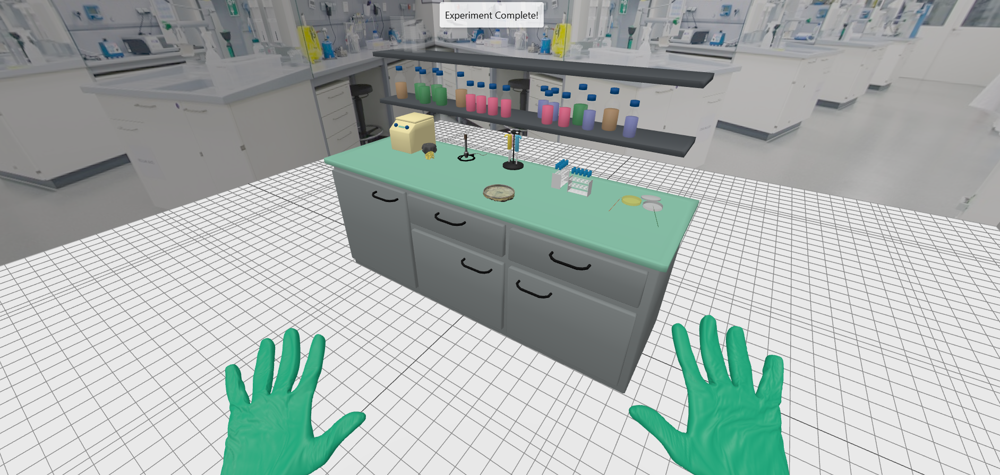

# Bio-Visual Project

The **Bio-Visual** project is an advanced 3D virtual laboratory that provides an interactive and immersive environment for biological experimentation and learning. This project leverages cutting-edge web technologies to simulate real-world lab scenarios, making it ideal for educational purposes, training, or research demonstrations.



## Project Overview

Bio-Visual allows users to:

- **Engage with 3D models** of lab equipment such as bunsen burners, petri dishes, and more.
- **Follow step-by-step experimental instructions** with visual and text-based guides.
- **Learn through interactivity**, where every action is reflected in the virtual environment.
- **Simulate realistic lab scenarios**, including handling tools and observing results in real-time.

The project was built with a focus on accessibility, scalability, and integration into modern web applications.

---

## Features

1. **High-Quality 3D Models**:
   - Detailed and textured models of lab tools.
   - Real-world accuracy to enhance educational value.

2. **Interactive Lab Environment**:
   - Perform experiments virtually by interacting with lab equipment.
   - Use tools such as gloves, flint strikers, and more.

3. **Step-by-Step Instructions**:
   - Clear and concise instructions to guide users.
   - Integrated visual and text feedback.

4. **Browser-Based**:
   - No installation needed for end-users.
   - Runs directly in modern web browsers.

5. **Customizability**:
   - Easily add or modify experiments.
   - Extend the system with new 3D models and scripts.

---

## System Requirements

- **Minimum Requirements:**
  - A web browser e.g. Chrome, Firefox, Edge.

- **Development Requirements:**
  - Generating a local web server.
---

## Installation

### Option 1: Run Locally

1. Clone the repository:
   ```bash
   git clone https://github.com/jongsoo1203/Bio-Visual.git
   cd Bio-Visual
   ```

2. Start a local development server:
   ```bash
   live server feature of VSCode or python server.
   ```

4. Access the application at:
   ```
   http://localhost:3000
   ```

### Option 2: Hosted Version

   ```
   https://jongsoo1203.github.io/Bio-Visual/
   ```

---

## File Structure

```
Bio-Visual/
├── index.html             # Main entry point
├── styles.css             # Styling for the application
├── main.js                # Core application logic
├── LabEnvironment.js      # Environment setup and configuration
├── 3DExperiment.js        # Experiment-specific logic
├── models/                # 3D model files (.glb, .obj, etc.)
├── textures/              # Background and object textures
└── README.md              # Documentation
```

---


